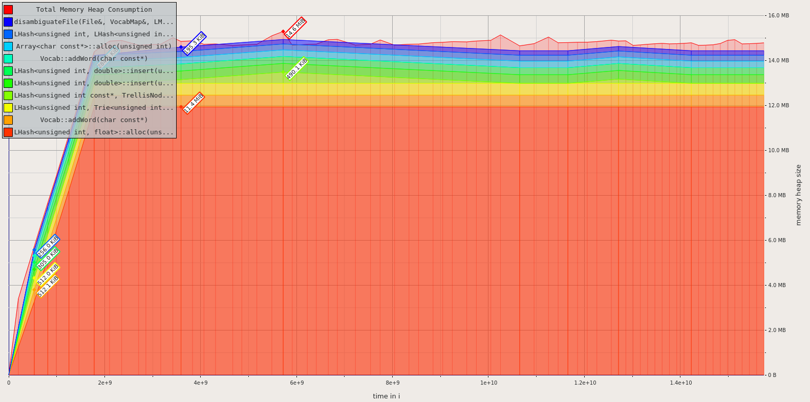
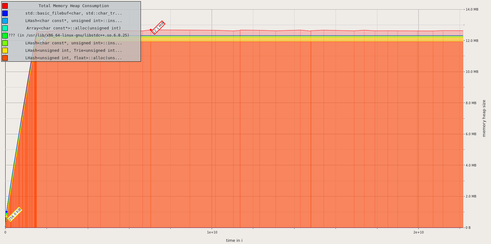
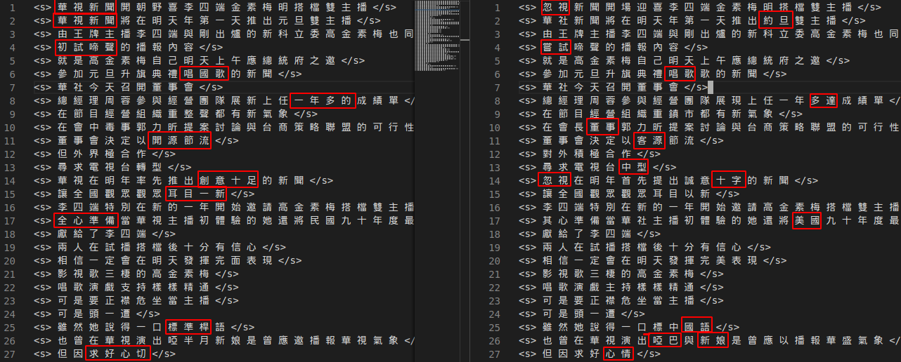

> b06901145 李子筠

### disambig 與 mydisambig 比較	

|                   | disambig | mydisambig |
| :---------------: | :------: | ---------- |
|      time(s)      |  41.930  | 102.474    |
| memory usage(MiB) |   14.6   | 12.1       |

在時間上 mydisambig 比 disambig 慢了 2.38 倍 (時間為處理 1~10.txt 以及 example.txt 的時間加總)

但記憶體使用量少了 2 MiB 左右(以 1.txt 來量測記憶體用量)

- disambig

- mydisambig

可以看到大部份(80% 以上)的記憶體都是用來儲存 ZhuYin-Big5.map

### Trigram 和 Bigram 比較

用 srilm disambig 的 -order 3 可以看到 trigram 跑出來的結果。很明顯的可以看到 trigram 對較長的詞比較能正確辨識， bigram 則傾向於把兩個字合在一起。

感覺這種方法沒有分析文法結構(句型、詞性)，所以不知道哪些地方是詞的邊界，所以 bigram 和 trigram 才會互相競爭。

### what I have done

這次只有實做 bigram 版本，大致上只是把 mapping 的 key 當成 state， value 則是那個 state 可以得到的 observation，機率則是由 ngram-count 從 corpus.txt 統計頻率。

因為大部分的時間只有一種可能的 observation (國字)，delta 不太適合用矩形陣列存。所以我用兩層 vector 來存 delta。

### 可以改進的地方

解讀注音文其實跟解讀聲音不同，注音以外的部份相當於是已經確定的 state，不需要去計算他發生的機率。如果是 bigram，會影響 path 的部份就只有兩個相鄰的字包含注音的時候。也就是說，如果 state 為 國字，其實可以直接使用前面 path 的累積機率，不需要加上自己的機率 (只有一個可能性的時候 argmax 就是那唯一一個)。
